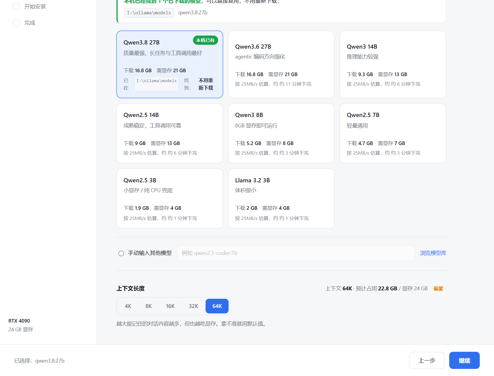
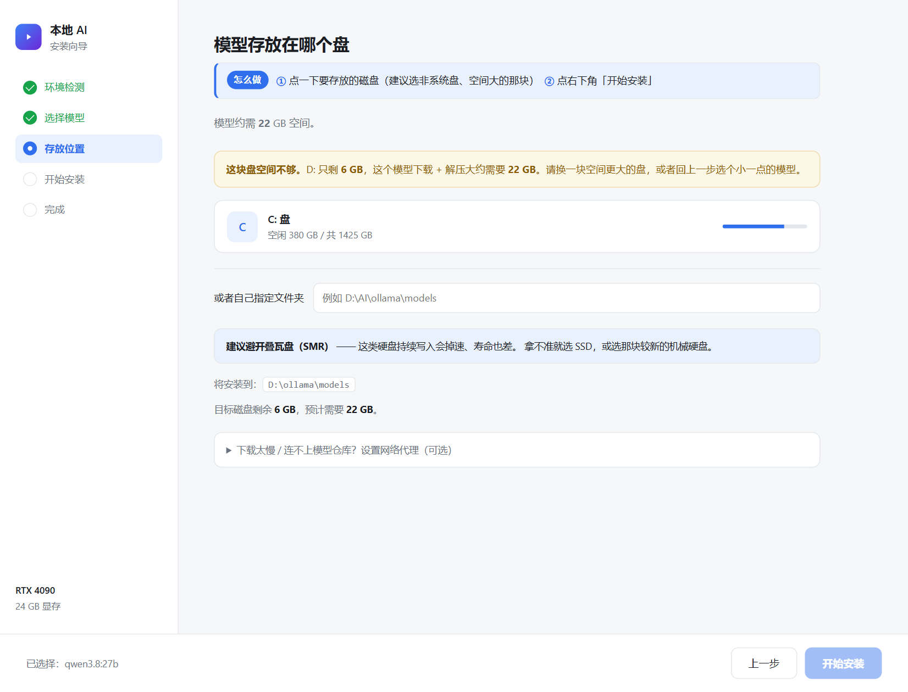
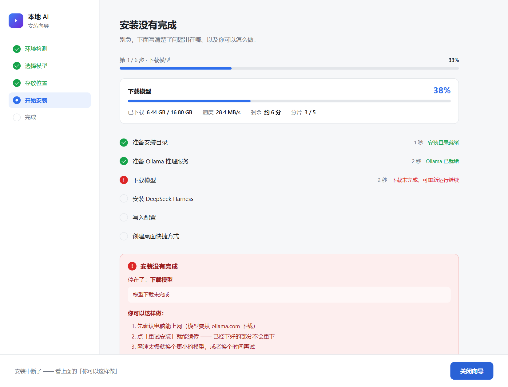
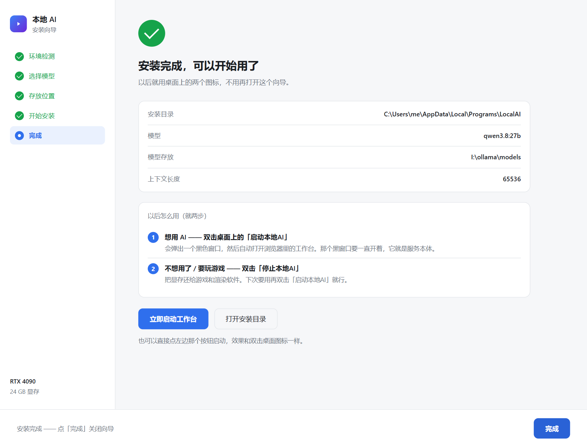
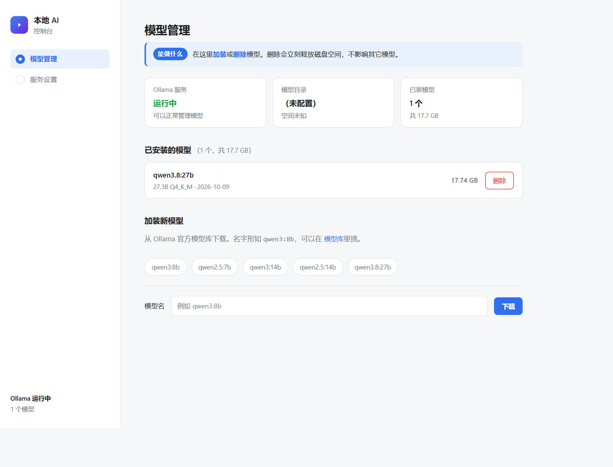
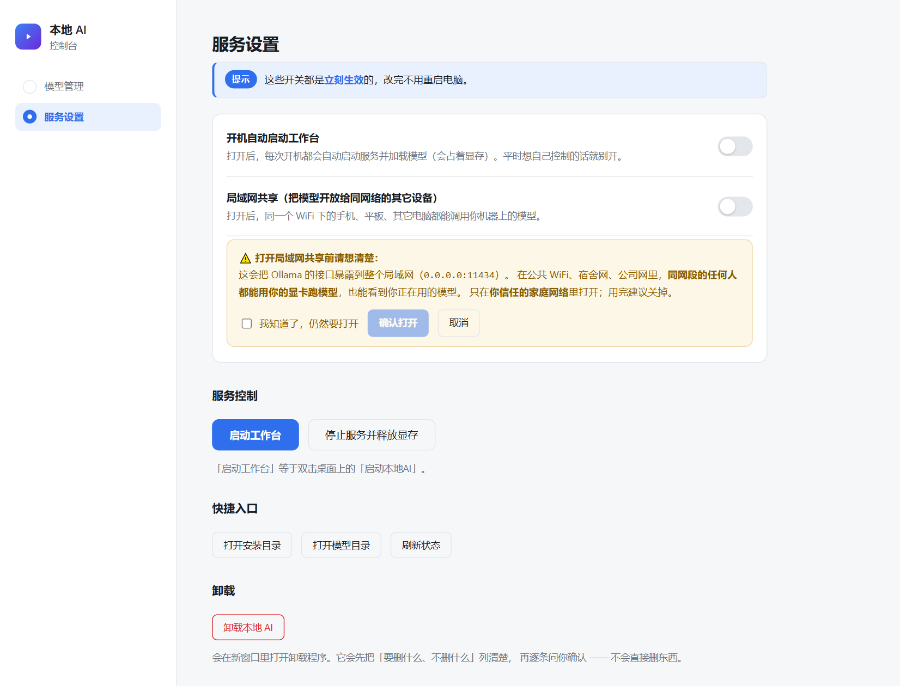

# 本地 AI 一站式部署

一个**图形化安装向导**，自动识别你的电脑配置、按显存推荐合适的模型，一键把大模型跑在本地显卡上。

不联网、不花钱、不限次数。

---

## 它解决什么问题

想在本地跑大模型，通常要面对：装 Node.js、装 Ollama、拉模型、配环境变量、配 Agent 框架、
处理各种路径和权限问题……任何一步出错都会卡住，而且报错信息对非技术用户毫无意义。

这个工具把这些全部包进一个**双击即用的安装向导**：

- **自动识别硬件** —— 显卡型号、显存大小、磁盘空间、已安装组件，打开就知道
- **按显存推荐模型** —— 只列出你跑得动的，最适合的标「推荐」
- **自动处理依赖** —— 缺 Node.js 自动装，缺 Ollama 自动装，权限不足弹窗申请
- **装完就能用** —— 桌面自动生成两个快捷方式：启动 / 停止

## 界面预览

**1. 环境检测** —— 自动识别你的电脑，一进来就告诉你「接下来只需要三步」


**2. 选择模型** —— 按显存过滤，卡片式选择，估算下载时间；本机已有模型直接标出来复用


**2b. 上下文与显存估算** —— 4K/8K/16K/32K/64K 可调，实时显示估算占用



**3. 存放位置** —— 磁盘列表带用量条


**3b. 空间预检** —— 空间不够直接拦住，不让用户带着必然失败的任务往下走



**4. 安装进度** —— 整体步骤进度 + 下载模型实时进度（已下载量 / 速度 / 剩余时间）


**5. 出错排查** —— 停在哪一步 / 原因 / 你可以这样做，外加一键重试与复制诊断信息



**6. 完成** —— 直接告诉你以后怎么用，可以一键启动工作台



**7. 本地AI控制台 · 模型管理** —— 已装模型一览、一键删除、一键加装（带进度）



**8. 本地AI控制台 · 服务设置** —— 开机自启、局域网共享（强制二次确认）、启动/停止、卸载



## 快速开始

### 方式一：下载 ZIP（推荐给普通用户）

1. 点右上角绿色的 **Code** 按钮 → **Download ZIP**
2. 解压到任意位置（路径建议用英文）
3. 双击 **`① 双击这里开始安装.cmd`**
4. 跟着向导点「继续」

就这四步。缺什么依赖，安装程序会自己处理。

### 方式二：克隆仓库

```bash
git clone https://github.com/regdiliKUN/local-ai-kit.git
```

然后双击 `① 双击这里开始安装.cmd`。

### 方式三：从 Releases 下载

到 [Releases](https://github.com/regdiliKUN/local-ai-kit/releases) 页面下载打包好的 zip。

## 硬件要求

| 项目 | 最低 | 推荐 |
|---|---|---|
| 显卡 | NVIDIA 16GB 显存 | NVIDIA 24GB 显存（如 RTX 4090） |
| 内存 | 32 GB | 64 GB |
| 磁盘 | 30 GB 空闲 | 50 GB 以上空闲 |

没有独立显卡也能跑，但只能用小模型，速度很慢。
AMD 显卡能识别显存并推荐模型，但 Ollama 只支持部分型号加速；Intel 集显按无独显处理。

## 可选模型

安装向导会按显存只列出跑得动的，下表是完整参考：

| 模型 | 下载体积 | 需要显存 | 适合 |
|---|---|---|---|
| `qwen3.8:27b` | 16.8 GB | 21 GB+ | 24GB 显存，质量最强 |
| `qwen3.6:27b` | 16.8 GB | 21 GB+ | 24GB 显存，偏编码 |
| `qwen3:14b` | 9.3 GB | 13 GB+ | 16GB 显存，推理强 |
| `qwen2.5:14b` | 9.0 GB | 13 GB+ | 16GB 显存，稳 |
| `qwen3:8b` | 5.2 GB | 8 GB+ | 8GB 显存 |
| `qwen2.5:7b` | 4.7 GB | 7 GB+ | 轻量 |
| `qwen2.5:3b` | 1.9 GB | 4 GB+ | 小显存 / 纯 CPU |
| `llama3.2:3b` | 2.0 GB | 4 GB+ | 很轻 |

也可以手动输入 Ollama 上的任意模型。模型库见 https://ollama.com/library

## 工作原理

安装完成后，你的电脑上会有三层：

| 层 | 是什么 | 有没有界面 |
|---|---|---|
| **Ollama** | 推理引擎，把模型跑在显卡上 | 没有界面，纯后台服务 |
| **DeepSeek Harness** | 驾驶舱，让你跟模型对话、派活 | 有，是浏览器里的网页 |
| **启动器** | 一键点火 | 一个黑窗口 |

装了 DeepSeek Harness 之后，模型不只是「会聊天的 API」——
它能**读文件、写代码、执行命令、连续完成多步任务**。

## 装完之后能做什么

桌面会有三个图标：

| 图标 | 作用 |
|---|---|
| **启动本地AI** | 启动服务并打开浏览器工作台 |
| **停止本地AI** | 停止服务、释放显存 |
| **本地AI控制台** | 加装 / 删除模型、开机自启、局域网共享、启动停止服务、卸载 |

**本地AI控制台**是个本地网页（和安装向导同一套零依赖实现）：

- **模型管理** —— 已装模型一览（体积 / 量化 / 日期）、一键删除、一键加装（带进度）
- **服务设置** —— 开机自启、局域网共享（默认关，打开前强制二次确认）、
  启动工作台 / 停止服务、打开安装目录 / 模型目录
- **卸载入口** —— 打开逐步确认的卸载程序

## 常见问题

**双击后弹出一句英文报错？**
那是缺 Node.js（`'node' is not recognized...`）。新版会自动帮你装 ——
双击后按回车，在授权窗口点「是」即可。

**下载中断了怎么办？**
重新双击 `① 双击这里开始安装.cmd`，会接着下，不用重头来。
向导还开着的话，直接点红色面板上的「重试安装」更快。

**安装失败 / 卡住了怎么办？**
不会只给你一句报错。失败时页面会展开排查面板，写清「停在哪一步 / 原因 / 你可以这样做」，
并提供「重试安装」「重新检测」「复制诊断信息」「打开日志」四个按钮。
日志文件在 `%TEMP%\localai-setup.log`。

**提示「这块盘空间不够」/「显卡驱动太旧」？**
向导在下载之前就会拦住：空间按模型体积的 1.3 倍校验，驱动版本按 `nvidia-smi` 解析后比对。
按提示换盘 / 换小模型 / 升级驱动即可。

**想加装或删除模型？**
打开「本地AI控制台」→ 模型管理。删除会立刻释放磁盘空间，不影响其它模型。

**怎么卸载？**
「本地AI控制台」→ 服务设置 → 卸载本地 AI，或安装目录里的 `卸载.cmd`。
每一步都会先问，模型文件单独确认一次。

**下载很慢 / 连不上模型仓库？**
向导的「存放位置」那一步最下面可以展开「设置网络代理」。
另外**本机已有模型会被自动发现并直接复用**（选模型时卡片标「本机已有」），不用重复下载。

**提示需要管理员权限？**
点弹窗里的「自动以管理员身份继续」，会自动以管理员身份重启向导（会弹 UAC，点「是」）。
不需要自己去右键运行。

**我自己改过 DeepSeek Harness 的配置（加过云端模型），重装会被覆盖吗？**
不会。安装器只更新它自己那几行（本地 provider、压缩参数），
同一个文件里你手写的其它 provider / 插件设置原样保留，改动前还会留带时间戳的备份（保留 3 份）。

**聊得久了，AI 突然说「已达输出 token 上限」，点继续也没用？**
v1.2.0 已修。原因是 `compaction-basic` 默认预留 65536 token，与本地模型窗口相等，
导致自动压缩被静默禁用。新版安装时会写入正确的压缩参数，长对话会被自动摘要压缩。

**下载模型时看不到下了多少 / 进度条一直乱跳？**
v1.1.1 已修复。模型是多个分片同时下载的，之前界面显示的是单个分片的百分比，所以会来回跳。
现在汇总所有分片的整体进度，并显示已下载 / 总大小、实时速度、预计剩余时间。

**显存不够 / 加载失败？**
重新运行安装向导，在选模型那一步选个更小的。
也可以改安装目录里的 `配置.json`，把 `contextWindow` 改小，重启。

**怎么停止服务、把显存还回来？**
双击桌面「停止本地AI」。

**可以装到别的电脑吗？**
可以。把整个文件夹复制过去，在新电脑上双击 `① 双击这里开始安装.cmd`。

## 目录结构

```
.
├── ① 双击这里开始安装.cmd   # 入口，双击这个
├── 使用说明.html            # 完整说明（双击用浏览器打开）
├── 使用说明（纯文本版）.md
├── 备用-命令行安装.cmd      # 无图形界面模式
├── ui/                      # 安装向导界面
├── icons/                   # 桌面快捷方式图标
├── docs/                    # 界面截图
└── scripts/                 # 安装与运行脚本
```

## 技术实现

- **纯 Node.js**，零第三方依赖（安装向导的界面是本地网页，不用 Electron）
- 自动识别桌面真实路径（支持桌面被重定向到别的盘）
- 桌面快捷方式通过手写 `.lnk` 二进制生成，不依赖 COM
- **dsh 配置定点合并**：`scripts/yamlpatch.mjs` 是一个按缩进分块的极简 YAML 修补器，
  只替换安装器自己那几个条目，用户在同一个文件里写的内容原样保留
- 安装过程幂等，可重复运行

## 更新记录

### v1.3.0

**主题：把「装完之后的日常」补齐 —— 模型能自己加删、设置能自己开关、想删能干净卸掉。**

**新增：本地AI控制台**（桌面第三个图标，`控制台.cmd`）

- 模型管理：列出已装模型（体积 / 量化 / 日期）、一键删除（原地二次确认）、
  一键加装（带实时进度 / 速度 / 剩余时间）
- 服务设置：开机自启开关、局域网共享开关、启动工作台 / 停止服务、打开安装目录 / 模型目录
- 局域网共享**默认关闭**，打开前必须在警告里打勾确认

**新增：一键卸载**（`卸载.cmd` / 控制台入口）

- 先把「要删什么、不删什么」逐条列清楚再逐条确认
- 模型文件单独问一次，且**只有路径确实是 `...\ollama\models` 结构时才允许自动删**
- 删除安装目录用延迟删除，绕开「自己正跑在里面删不掉」的问题
- 非交互环境（脚本里跑）直接退出，什么都不删

**新增：下载加速**

- **本机模型扫描与复用**：自动扫各盘的 `ollama\models`，已有模型标「本机已有」直接复用
- **可选 HTTP 代理**：下载慢 / 连不上时填代理地址（走命令行 pull，因为 Node 的 fetch
  默认不认系统代理，而 Ollama 认 `HTTPS_PROXY`）

**新增：两项预检**

- **磁盘空间预检**：按模型体积 1.3 倍校验，不够则界面警告 + 禁用按钮，服务端再拦一道
- **显卡驱动版本预检**：解析 `nvidia-smi` 驱动版本，低于保守下限报错、低于建议值提示升级
  （驱动太旧时 Ollama 会静默退回 CPU）

**新增：上下文可调 + 模型完整性校验**

- 选模型时可直接切 4K / 8K / 16K / 32K / 64K，实时显示估算显存占用与「够用 / 偏紧 / 可能超出」
- 新增「校验模型」安装步骤：`/api/show` 确认注册 + 真加载一次（1 token），
  显存装不下当场报出来，而不是等用户打开工作台才发现

### v1.2.0

**主题：把「每一步该做什么」讲清楚，把出错后的自救路径补上。**

**交互引导**

- 每一步顶部新增「**怎么做**」指令条（「① 点一下卡片 ② 点右下角继续」），不用猜
- 检测页新增「**接下来只需要三步**」预告，一进来就知道全程要干什么
- 新增「**重新检测**」按钮（刚装完驱动 / Ollama 不用重开向导）
- 模型卡片新增**预计下载时间**估算
- 安装页新增「**请保持这个页面开着**」提醒条，并说明中断也能续装
- 完成页改成「以后怎么用（就两步）」图文，新增「**立即启动工作台**」「**打开安装目录**」按钮

**出错时的自救路径**

- 失败不再只甩一句报错：展开排查面板，写清「**停在哪一步 / 原因 / 你可以这样做**」
- 新增「**重试安装**」（已装好的步骤自动跳过、模型续传）
- 新增「**复制诊断信息**」（环境 + 报错 + 日志一键复制）与「**打开日志**」
- 全程写日志到 `%TEMP%\localai-setup.log`
- **缺 Ollama 不再算「失败」**：改为「需要你完成一步操作」，装完 Ollama 后**自动续装**
- **权限不足可自动提权**：弹窗按钮改为「自动以管理员身份继续」，自动以管理员身份重启向导
- 控制台启动横幅重写；端口全被占用时给出排查命令

**修掉的问题**

- **修掉会覆盖用户配置的严重 bug**：之前只要配置文件以「由本地 AI 安装向导生成」开头，
  重装时就会**整份覆盖**，把用户自己加的云端 provider、插件设置全部抹掉。
  现在改为**定点合并**（只替换本地 provider 与压缩参数），其余原样保留，改动前备份（保留 3 份）
- **修掉「长对话被截断」**：`compaction-basic` 默认 `headroomTokens = 65536`，
  与本地模型窗口相等 → 压力预算为负 → **自动压缩被静默禁用**，
  会话涨满后报「已达输出 token 上限」且点「继续」也救不回来。
  现在安装时自动写入正确的压缩参数
- **上下文长度上限从 32768 提到 65536**（配合 KV cache 量化，24GB 显存可全量驻留 64K）
- 上下文长度改为服务端统一计算后下发，图形向导与命令行安装不再各算一套

### v1.1.1

**修复：下载模型时看不到下载进度**

- 模型是分成多个分片（layer）同时下载的，之前界面直接把「某一个分片」的百分比当成整体进度，
  导致进度条在 100% / 3% / 67% 之间乱跳，用户根本看不出到底下了多少
- 现在改用 Ollama 的 `/api/pull` 流式接口（拿到每个分片的 `digest` / `total` / `completed`），
  按分片分别记账后汇总成**整体进度**；拿不到接口时退回命令行解析
- 进度条只增不减；已知模型标称体积时用它做分母，避免刚开始进度虚高

**新增**

- 当前步骤显示 **已下载 / 总大小**、**实时速度**、**预计剩余时间**、**分片数**
- 顶部新增**整体步骤进度**（第 N / 6 步 · 当前步骤）
- 每一步显示**已用时**；启动服务、安装依赖这类没有百分比的步骤改为滚动进度条，
  不再看起来像卡死
- 下载 Ollama 安装包时也显示进度（之前这一步界面上完全没有提示）
- 安装 DeepSeek Harness 从 `spawnSync` 改为异步 `spawn`，npm 输出实时转发，
  安装期间界面不再一动不动

### v1.1.0

**安全**
- 安装向导的本地服务加了来源校验（Host 头 + 随机令牌），其他网页不能再借它触发安装
- 安装目录、Ollama 路径改由服务端自己检测，不再信任浏览器传来的值；模型名、目录做格式校验
- 下载的 Node.js 安装包校验 SHA256，Ollama 安装包校验数字签名，对不上就不安装

**修复**
- 修复 Ollama 已在运行时，模型可能被下载到默认目录（C 盘）而不是你选的盘
- 修复开机自启的 Ollama 用错模型目录时，启动器提示「模型已就绪」但其实加载失败
- 修复 `.cmd` 文件在 GitHub「Download ZIP」下载后是 LF 换行、cmd.exe 可能出错（新增 `.gitattributes`）
- 修复命令行安装把上下文长度写死成 32768、和实际配置不一致
- 纯文本模型不再声明图片输入；不支持工具调用的模型会给出提示
- 写入 DeepSeek Harness 配置前先备份你原有的配置

**改进**
- 入口脚本优先使用部署包里自带的 `node\`（便携 Node），装完会把 node.exe 复制到安装目录
- 存放位置支持手动输入任意文件夹
- 支持 AMD 显卡显存识别、多显卡取显存最大的一张；ARM64 电脑自动装 arm64 版 Node.js
- 固定 DeepSeek Harness 版本（`@deepseek-ai/dsh@0.2.0-rc.2`），避免上游 RC 版本变化导致装完不能用
- 命令行安装与图形向导共用同一套安装引擎，不再各写一份
- 环境变量 `LOCALAI_NO_BROWSER=1` 可让安装向导不自动打开浏览器（远程桌面 / 自动化用）

## 安全提醒

- 不要把 Ollama（11434 端口）或工作台（3080 端口）映射到公网
- 让 AI 首次操作时，先用一个可以随便丢的文件夹试，确认没问题再指向重要项目
- 本地模型不会把你的内容发到网上 —— 这正是本地部署的意义

## License

MIT
