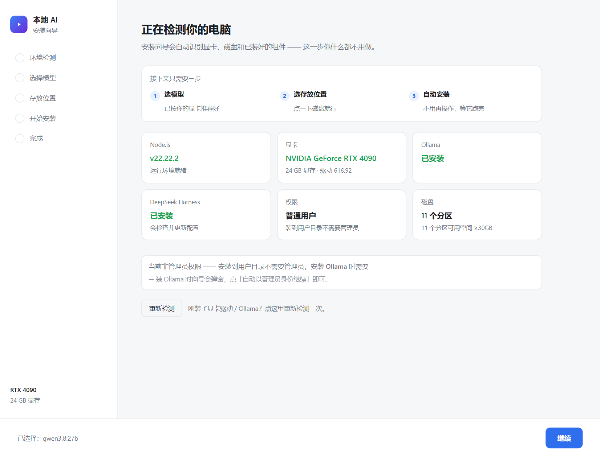
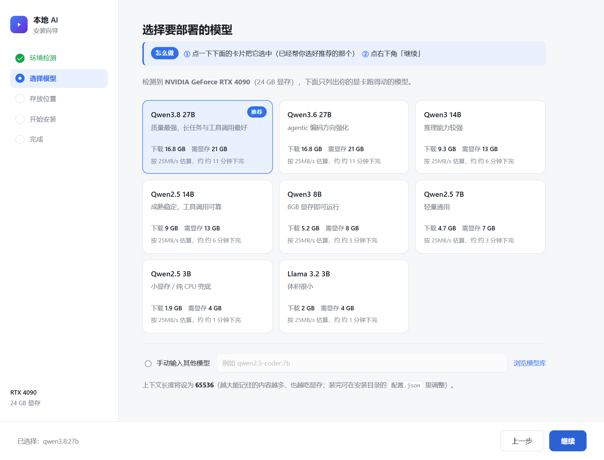
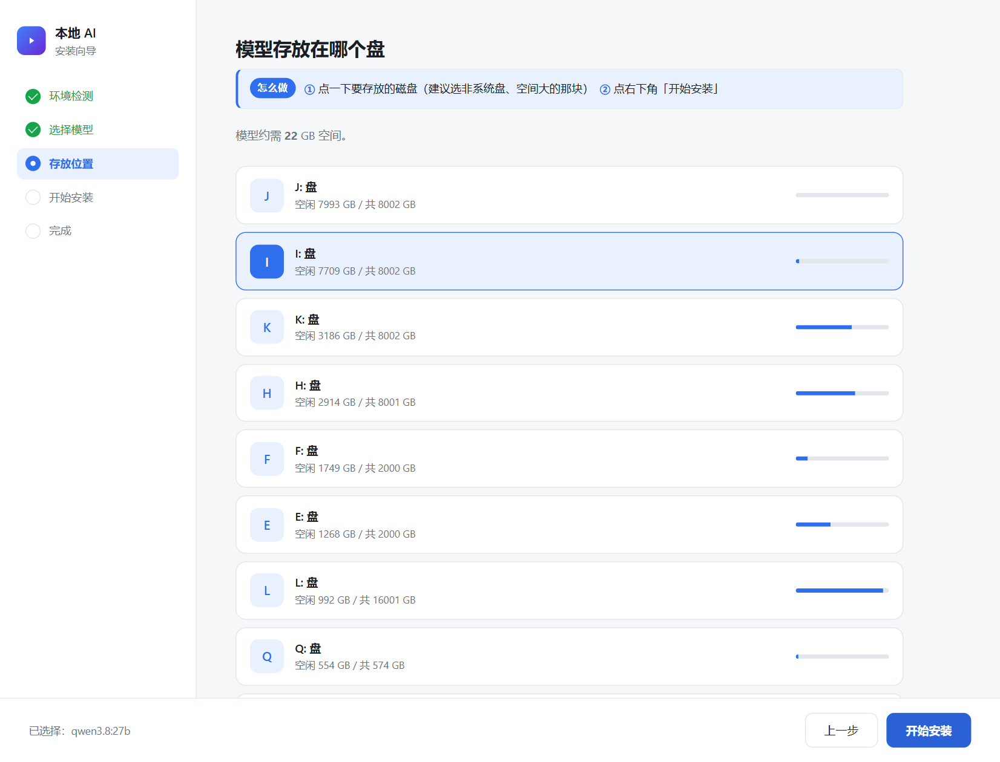
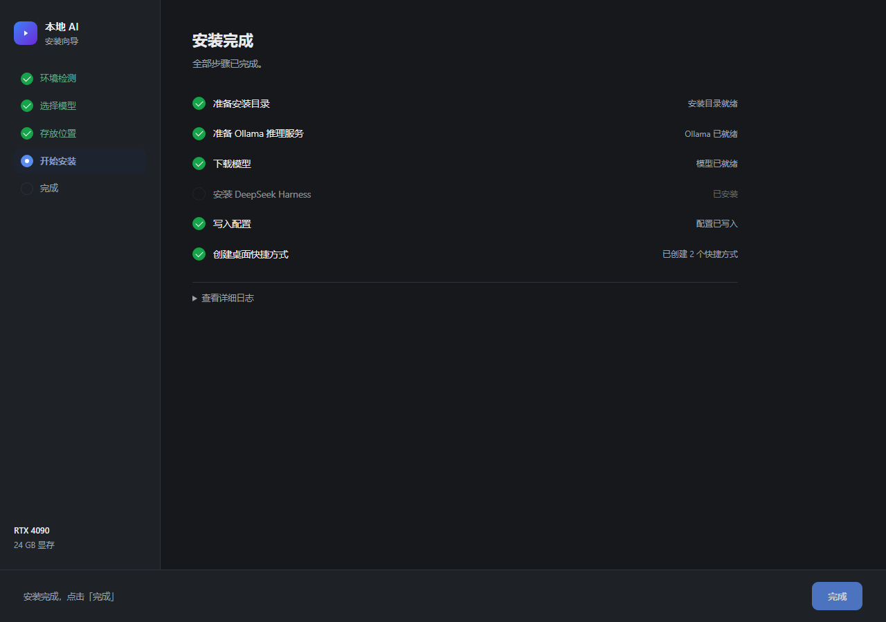

# 本地 AI 一站式部署

一个**图形化安装向导**，自动识别你的电脑配置、按显存推荐合适的模型，一键把大模型跑在本地显卡上。

不联网、不花钱、不限次数。

---

## 它解决什么问题

想在本地跑大模型，通常要面对：装 Node.js、装 Ollama、拉模型、配环境变量、配 Agent 框架、
处理各种路径和权限问题……任何一步出错都会卡住，而且报错信息对非技术用户毫无意义。

这个工具把这些全部包进一个**双击即用的安装向导**：

- **自动识别硬件** —— 显卡型号、显存大小、磁盘空间、已安装组件，打开就知道
- **按显存推荐模型** —— 只列出你跑得动的，最适合的标「推荐」
- **自动处理依赖** —— 缺 Node.js 自动装，缺 Ollama 自动装，权限不足弹窗申请
- **装完就能用** —— 桌面自动生成两个快捷方式：启动 / 停止

## 界面预览

**1. 环境检测** —— 自动识别你的电脑



**2. 选择模型** —— 按显存过滤，卡片式选择



**3. 存放位置** —— 磁盘列表带用量条



**4. 安装进度** —— 每步状态 + 实时日志



## 快速开始

### 方式一：下载 ZIP（推荐给普通用户）

1. 点右上角绿色的 **Code** 按钮 → **Download ZIP**
2. 解压到任意位置（路径建议用英文）
3. 双击 **`① 双击这里开始安装.cmd`**
4. 跟着向导点「继续」

就这四步。缺什么依赖，安装程序会自己处理。

### 方式二：克隆仓库

```bash
git clone https://github.com/regdiliKUN/local-ai-kit.git
```

然后双击 `① 双击这里开始安装.cmd`。

### 方式三：从 Releases 下载

到 [Releases](https://github.com/regdiliKUN/local-ai-kit/releases) 页面下载打包好的 zip。

## 硬件要求

| 项目 | 最低 | 推荐 |
|---|---|---|
| 显卡 | NVIDIA 16GB 显存 | NVIDIA 24GB 显存（如 RTX 4090） |
| 内存 | 32 GB | 64 GB |
| 磁盘 | 30 GB 空闲 | 50 GB 以上空闲 |

没有独立显卡也能跑，但只能用小模型，速度很慢。
AMD 显卡能识别显存并推荐模型，但 Ollama 只支持部分型号加速；Intel 集显按无独显处理。

## 可选模型

安装向导会按显存只列出跑得动的，下表是完整参考：

| 模型 | 下载体积 | 需要显存 | 适合 |
|---|---|---|---|
| `qwen3.8:27b` | 16.8 GB | 21 GB+ | 24GB 显存，质量最强 |
| `qwen3.6:27b` | 16.8 GB | 21 GB+ | 24GB 显存，偏编码 |
| `qwen3:14b` | 9.3 GB | 13 GB+ | 16GB 显存，推理强 |
| `qwen2.5:14b` | 9.0 GB | 13 GB+ | 16GB 显存，稳 |
| `qwen3:8b` | 5.2 GB | 8 GB+ | 8GB 显存 |
| `qwen2.5:7b` | 4.7 GB | 7 GB+ | 轻量 |
| `qwen2.5:3b` | 1.9 GB | 4 GB+ | 小显存 / 纯 CPU |
| `llama3.2:3b` | 2.0 GB | 4 GB+ | 很轻 |

也可以手动输入 Ollama 上的任意模型。模型库见 https://ollama.com/library

## 工作原理

安装完成后，你的电脑上会有三层：

| 层 | 是什么 | 有没有界面 |
|---|---|---|
| **Ollama** | 推理引擎，把模型跑在显卡上 | 没有界面，纯后台服务 |
| **DeepSeek Harness** | 驾驶舱，让你跟模型对话、派活 | 有，是浏览器里的网页 |
| **启动器** | 一键点火 | 一个黑窗口 |

装了 DeepSeek Harness 之后，模型不只是「会聊天的 API」——
它能**读文件、写代码、执行命令、连续完成多步任务**。

## 常见问题

**双击后弹出一句英文报错？**
那是缺 Node.js（`'node' is not recognized...`）。新版会自动帮你装 ——
双击后按回车，在授权窗口点「是」即可。

**下载中断了怎么办？**
重新双击 `① 双击这里开始安装.cmd`，会接着下，不用重头来。

**显存不够 / 加载失败？**
重新运行安装向导，在选模型那一步选个更小的。
也可以改安装目录里的 `配置.json`，把 `contextWindow` 改小，重启。

**怎么停止服务、把显存还回来？**
双击桌面「停止本地AI」。

**可以装到别的电脑吗？**
可以。把整个文件夹复制过去，在新电脑上双击 `① 双击这里开始安装.cmd`。

## 目录结构

```
.
├── ① 双击这里开始安装.cmd   # 入口，双击这个
├── 使用说明.html            # 完整说明（双击用浏览器打开）
├── 使用说明（纯文本版）.md
├── 备用-命令行安装.cmd      # 无图形界面模式
├── ui/                      # 安装向导界面
├── icons/                   # 桌面快捷方式图标
├── docs/                    # 界面截图
└── scripts/                 # 安装与运行脚本
```

## 技术实现

- **纯 Node.js**，零第三方依赖（安装向导的界面是本地网页，不用 Electron）
- 自动识别桌面真实路径（支持桌面被重定向到别的盘）
- 桌面快捷方式通过手写 `.lnk` 二进制生成，不依赖 COM
- 安装过程幂等，可重复运行

## 更新记录

### v1.1.0

**安全**
- 安装向导的本地服务加了来源校验（Host 头 + 随机令牌），其他网页不能再借它触发安装
- 安装目录、Ollama 路径改由服务端自己检测，不再信任浏览器传来的值；模型名、目录做格式校验
- 下载的 Node.js 安装包校验 SHA256，Ollama 安装包校验数字签名，对不上就不安装

**修复**
- 修复 Ollama 已在运行时，模型可能被下载到默认目录（C 盘）而不是你选的盘
- 修复开机自启的 Ollama 用错模型目录时，启动器提示「模型已就绪」但其实加载失败
- 修复 `.cmd` 文件在 GitHub「Download ZIP」下载后是 LF 换行、cmd.exe 可能出错（新增 `.gitattributes`）
- 修复命令行安装把上下文长度写死成 32768、和实际配置不一致
- 纯文本模型不再声明图片输入；不支持工具调用的模型会给出提示
- 写入 DeepSeek Harness 配置前先备份你原有的配置

**改进**
- 入口脚本优先使用部署包里自带的 `node\`（便携 Node），装完会把 node.exe 复制到安装目录
- 存放位置支持手动输入任意文件夹
- 支持 AMD 显卡显存识别、多显卡取显存最大的一张；ARM64 电脑自动装 arm64 版 Node.js
- 固定 DeepSeek Harness 版本（`@deepseek-ai/dsh@0.2.0-rc.2`），避免上游 RC 版本变化导致装完不能用
- 命令行安装与图形向导共用同一套安装引擎，不再各写一份
- 环境变量 `LOCALAI_NO_BROWSER=1` 可让安装向导不自动打开浏览器（远程桌面 / 自动化用）

## 安全提醒

- 不要把 Ollama（11434 端口）或工作台（3080 端口）映射到公网
- 让 AI 首次操作时，先用一个可以随便丢的文件夹试，确认没问题再指向重要项目
- 本地模型不会把你的内容发到网上 —— 这正是本地部署的意义

## License

MIT
